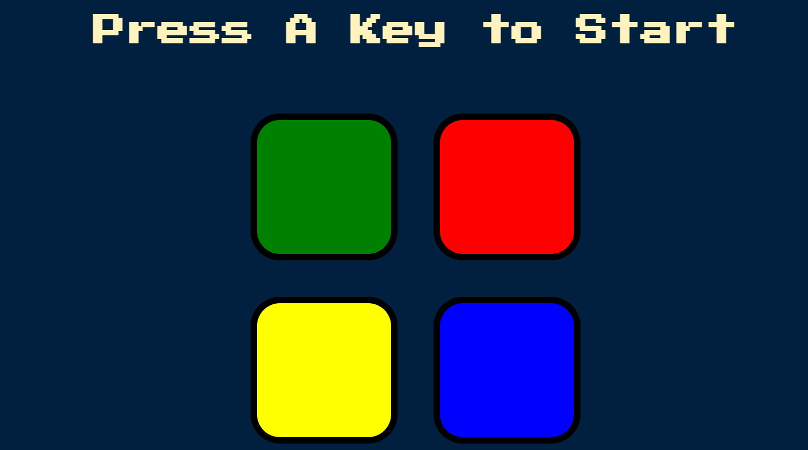

# js-simonGame

# Simon Game

Welcome to the **Simon Game**! This project is a web-based version of the classic memory game "Simon," where players must repeat a sequence of colors and sounds in the correct order. The game gets progressively harder as the sequence length increases.



## Table of Contents

- [Demo](#demo)
- [Features](#features)
- [Installation](#installation)
- [Usage](#usage)
- [Technologies Used](#technologies-used)
- [Contributing](#contributing)

## Demo

You can play the Simon Game online: [Live Demo](https://nishu0tanwar.github.io/js-simonGame/)

## Features

- Simple and intuitive user interface
- Progressive difficulty with increasing sequence lengths
- Sound and color feedback for user interaction
- High score tracking (optional feature to be implemented)

## Installation

To run this project locally, follow these steps:

1. **Clone the repository:**

```bash
   git clone https://github.com/nishu0tanwar/js-simonGame.git
```

2. **Navigate to the project directory:**
 ```bash
   cd js-simonGame
 ```
3. **Open the index.html file in your browser:** <br>
   You can do this by simply double-clicking the index.html file or running a local server using a tool like Live Server in VS Code.

## Usage
The game is simple to play:
Click the Start button to begin.
Watch the sequence of colors that light up and listen to the corresponding sounds.
Repeat the sequence by clicking the colored buttons in the correct order.
The sequence will grow by one color each round. Keep playing as long as you can remember the sequence!

## Technologies Used
- HTML5
- CSS3
- JavaScript
  
## Contributing
Contributions are welcome! If you'd like to contribute to this project, please follow these steps:
- Fork the repository
- Create a new branch (git checkout -b feature-branch)
- Commit your changes (git commit -m 'Add new feature')
- Push to the branch (git push origin feature-branch)
- Open a Pull Request
